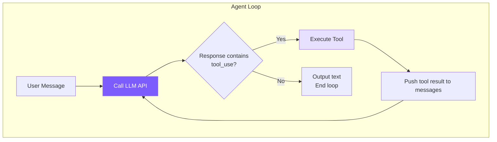

# 1. Agent Loop -- The Core Cycle

## Chapter Goals

Build the heart of a coding agent: a loop that keeps going — "call the model → see if it wants a tool → run it → feed the result back → call the model again" — until the model says the task is done.

The starting point is a dozen-line loop; run it the first time and it can only chat, not read a file; add a small tool round-trip and reading a file starts to work. Once that step is done, looking back at the real Claude Code loop makes it clear what all its extra complexity is solving.



## First Version: A Loop That Only Chats

Start with the dumbest version. Push the user's message onto the array, call the model once, print the reply — that's it:

```typescript
async function chatOnce(messages, userMessage) {
  messages.push({ role: "user", content: userMessage });

  const response = await client.messages.create({
    model: "claude-...",
    max_tokens: 4096,
    messages,
  });

  const text = response.content.find(b => b.type === "text")?.text ?? "";
  console.log(text);
  messages.push({ role: "assistant", content: response.content });
}
```

It can chat, sure. Ask "explain quicksort" and it answers well. But the moment it needs to do real work, the problem shows up:

```
> read src/agent.ts and explain the main loop
I don't have a way to read your files directly. If you paste the contents, I can help analyze them...
```

It's not unwilling — it just has no hands. The model can only emit text, and this code only prints text back. It wants to read a file, run a command, but the path is blocked at every step: the request never told it which tools exist, and even if it asked, there's nothing to catch that, actually run it, and pass the result back.

## Giving the Loop Hands: The Tool Round-Trip

Letting the model act takes just two things. One is to include a tool list in the request, telling it "you can call read_file, run_shell, and so on." The other is that when its reply carries "I want to call read_file," we actually run it, feed the result back as the next message, and then call the model again so it can keep going.

Those two things are where the `while` loop comes from. Turn the `chatOnce` above into this:

```typescript
async function chat(messages, userMessage) {
  messages.push({ role: "user", content: userMessage });

  while (true) {
    const response = await client.messages.create({
      model: "claude-...",
      max_tokens: 4096,
      messages,
      tools: toolDefinitions,   // <- just this one line: send the tool list so the model knows what it can call
    });
    messages.push({ role: "assistant", content: response.content });

    // pick out the tools the model wants to call this round
    const toolUses = response.content.filter(b => b.type === "tool_use");
    if (toolUses.length === 0) break;   // none -> it considers the task done, exit

    // run them one by one, collect the results
    const toolResults = [];
    for (const toolUse of toolUses) {
      printToolCall(toolUse.name, toolUse.input);
      const result = await executeTool(toolUse.name, toolUse.input);
      printToolResult(toolUse.name, result);
      toolResults.push({ type: "tool_result", tool_use_id: toolUse.id, content: result });
    }

    // feed the results back as one user message, loop to the top, model continues
    messages.push({ role: "user", content: toolResults });
  }
}
```

Just two additions over the first version: `tools: toolDefinitions` in the request (so the model knows which tools exist), and a `while` around it (run the tools, feed the results back, ask another round). The same request that couldn't read a file a moment ago now works:

```
> read src/agent.ts and explain the main loop
  ⏺ read_file(src/agent.ts)
  ⎿ import Anthropic from "@anthropic-ai/sdk"; …(~2169 lines)
The main loop is in chatAnthropic: a while(true) that each round calls the model, extracts tool_use, runs the tools, and feeds results back as a user message, exiting once a round asks for no tool.
```

Look closely at what happened this round: the model got the question and replied with "I want to call read_file(src/agent.ts)"; the loop didn't stop — it actually read the file, pushed the content back onto the array as a user message, and called the model again; this time the model saw the file contents and explained the main loop, and since it asked for no tool this round, the loop exited.

**What decides whether the loop keeps turning is the model, from start to finish — not our code.** We wrote no "if it's a read-file request then…" branch — the model itself decides whether to act this step, whether that was enough, whether to go another round. That is the line between an agent and a chatbot.

To keep the trunk clear, the version above left out permission checks and graceful interruption. Add those two onto the same skeleton and you get the two-language version below — but note it's still just this chapter's skeleton, not everything in the repo. The `chatAnthropic()` in `agent.ts` layers still more on top: memory prefetch, context compression, budget control, cache-token accounting, streaming early execution — all added chapter by chapter later (compression in Ch.7, streaming early execution in Ch.5):

<!-- tabs:start -->
#### **TypeScript**
```typescript
// agent.ts -- chatAnthropic method (core Agent Loop)

private async chatAnthropic(userMessage: string): Promise<void> {
  this.anthropicMessages.push({ role: "user", content: userMessage });
  // Trigger auto-compact at the turn boundary: the last message is now plain-text user,
  // so slice(0, -1) inside compactAnthropic won't sever the tool_use <-> tool_result pair (see Ch.7)
  await this.checkAndCompact();

  while (true) {
    if (this.abortController?.signal.aborted) break;

    const response = await this.callAnthropicStream();

    // accumulate token usage
    this.totalInputTokens += response.usage.input_tokens;
    this.totalOutputTokens += response.usage.output_tokens;
    this.lastInputTokenCount = response.usage.input_tokens;

    // extract tool_use blocks
    const toolUses: Anthropic.ToolUseBlock[] = [];
    for (const block of response.content) {
      if (block.type === "tool_use") toolUses.push(block);
    }

    // push assistant response into history
    this.anthropicMessages.push({ role: "assistant", content: response.content });

    // no tool call -> task done
    if (toolUses.length === 0) {
      printCost(this.totalInputTokens, this.totalOutputTokens);
      break;
    }

    // execute each tool serially
    const toolResults: Anthropic.ToolResultBlockParam[] = [];
    for (const toolUse of toolUses) {
      if (this.abortController?.signal.aborted) break;

      const input = toolUse.input as Record<string, any>;
      printToolCall(toolUse.name, input);

      // permission check (see Ch.6)
      const perm = checkPermission(toolUse.name, input, this.permissionMode, this.planFilePath);
      if (perm.action === "deny") {
        toolResults.push({ type: "tool_result", tool_use_id: toolUse.id,
          content: `Action denied: ${perm.message}` });
        continue;
      }
      if (perm.action === "confirm" && perm.message && !this.confirmedPaths.has(perm.message)) {
        const confirmed = await this.confirmDangerous(perm.message);
        if (!confirmed) {
          toolResults.push({ type: "tool_result", tool_use_id: toolUse.id,
            content: "User denied this action." });
          continue;
        }
        this.confirmedPaths.add(perm.message);
      }

      const result = await executeTool(toolUse.name, input);
      printToolResult(toolUse.name, result);
      toolResults.push({ type: "tool_result", tool_use_id: toolUse.id, content: result });
    }

    // tool results pushed as a user message (Anthropic API requirement)
    this.anthropicMessages.push({ role: "user", content: toolResults });
  }
}
```
#### **Python**
```python
# agent.py -- _chat_anthropic method (core Agent Loop)

async def _chat_anthropic(self, user_message: str) -> None:
    self._anthropic_messages.append({"role": "user", "content": user_message})
    # Trigger auto-compact at the turn boundary: the last message is now plain-text user,
    # so [:-1] inside _compact_anthropic won't sever the tool_use <-> tool_result pair (see Ch.7)
    await self._check_and_compact()

    while True:
        if self._aborted:
            break

        self._run_compression_pipeline()
        response = await self._call_anthropic_stream()

        self.total_input_tokens += response.usage.input_tokens
        self.total_output_tokens += response.usage.output_tokens
        self.last_input_token_count = response.usage.input_tokens

        tool_uses = [b for b in response.content if b.type == "tool_use"]

        self._anthropic_messages.append({
            "role": "assistant",
            "content": [self._block_to_dict(b) for b in response.content],
        })

        if not tool_uses:
            if not self.is_sub_agent:
                print_cost(self.total_input_tokens, self.total_output_tokens)
            break

        tool_results = []
        for tu in tool_uses:
            if self._aborted:
                break
            inp = dict(tu.input) if hasattr(tu.input, 'items') else tu.input
            print_tool_call(tu.name, inp)

            # permission check (see Ch.6)
            perm = check_permission(tu.name, inp, self.permission_mode, self._plan_file_path)
            if perm["action"] == "deny":
                tool_results.append({"type": "tool_result", "tool_use_id": tu.id,
                                     "content": f"Action denied: {perm.get('message', '')}"})
                continue
            if perm["action"] == "confirm" and perm.get("message") \
               and perm["message"] not in self._confirmed_paths:
                confirmed = await self._confirm_dangerous(perm["message"])
                if not confirmed:
                    tool_results.append({"type": "tool_result", "tool_use_id": tu.id,
                                         "content": "User denied this action."})
                    continue
                self._confirmed_paths.add(perm["message"])

            result = await self._execute_tool_call(tu.name, inp)
            print_tool_result(tu.name, result)
            tool_results.append({"type": "tool_result", "tool_use_id": tu.id, "content": result})

        self._anthropic_messages.append({"role": "user", "content": tool_results})
```
<!-- tabs:end -->

## How the Message Array Grows

The key to understanding this loop is watching how the message array grows each round:

```
Round 1:
  messages = [
    { role: "user",      content: "help me fix a bug" }
    { role: "assistant", content: [text + tool_use(read_file)] }
    { role: "user",      content: [tool_result("file contents...")] }
  ]

Round 2 (model decides to edit after seeing the file):
  messages = [
    ...first 3,
    { role: "assistant", content: [text + tool_use(edit_file)] }
    { role: "user",      content: [tool_result("edit succeeded")] }
  ]

Round 3 (model considers the task done):
  messages = [
    ...first 5,
    { role: "assistant", content: [text("fixed!")] }  <- no tool_use -> break
  ]
```

A round with tools usually adds two entries: one assistant (the tool the model wants to call), one user (the tool result); the final round, where the model calls no tool, adds just one assistant text entry. The model sees the full history end to end every time — that's why it can "remember" what it did earlier; at this point, memory is nothing more than an ever-growing array. Tool results are carried as `role: "user"` because the Anthropic API requires it, and each result must find its way back to its call via `tool_use_id`.

## Wrapping Up: Letting It Stop

Once the loop is running, there will be times to stop it midway — pressing Ctrl+C to make it exit relies on `AbortController`:

<!-- tabs:start -->
#### **TypeScript**
```typescript
async chat(userMessage: string): Promise<void> {
  this.abortController = new AbortController();
  try {
    await this.chatAnthropic(userMessage);
  } finally {
    this.abortController = null;
  }
  printDivider();
  this.autoSave();
}

abort() {
  this.abortController?.abort();
}
```
#### **Python**
```python
async def chat(self, user_message: str) -> None:
    self._aborted = False
    try:
        if self.use_openai:
            await self._chat_openai(user_message)
        else:
            await self._chat_anthropic(user_message)
    finally:
        pass
    if not self.is_sub_agent:
        print_divider()
        self._auto_save()

def abort(self) -> None:
    self._aborted = True
```
<!-- tabs:end -->

The TS version uses `AbortController`: once `abort()` is called, the signal becomes `aborted`, the loop exits at the next checkpoint, and the signal is also passed to the Anthropic SDK, cancelling even an in-flight network request. The Python version has no `AbortController`; it uses an `_aborted` flag plus cancelling the current asyncio task to the same effect — the loop still exits at a checkpoint.

## What the Real Claude Code Does Beyond This

The loop above has one decision: continue if there's a tool_use, stop if not. The real Claude Code handles far more — taking its loop apart reflects exactly what stands between a toy loop and a production engine.

It splits one loop into two layers. The outer `QueryEngine` (~1,155 lines) runs the conversation's whole lifecycle — user input, USD budget, token stats, session recovery; the inner `queryLoop` (~1,728 lines) runs only how one query executes — message compression, API calls, tool execution, error recovery. The split is for separation of concerns: the outer layer needn't worry about "how to recover from a PTL error," and the inner one needn't worry about "how to parse user input."

Its inner loop is an async generator (`async function*`). Choosing a generator over callbacks buys two things: backpressure, so the producer doesn't keep generating until the consumer is done, and thus events never pile up; and a linear control flow, where every branch is expressed with ordinary `continue` / `break` and no state machine is needed.

"Continue the loop" splits into seven cases. The minimal version has just one (continue if there's a tool_use); it has seven:

| # | Name | When | What to do |
|---|------|---------|-------|
| 1 | `next_turn` | model called a tool | run it, push the result, continue |
| 2 | `collapse_drain_retry` | PTL error, a staged collapse exists | commit the collapse to free space, retry |
| 3 | `reactive_compact_retry` | PTL error, collapse space not enough | force a full summarizing compaction, retry |
| 4 | `max_output_tokens_escalate` | output truncated, first time | escalate to a higher token limit (16K→64K), retry |
| 5 | `max_output_tokens_recovery` | output truncated, escalation exhausted | inject a continuation prompt, retry up to 3 times |
| 6 | `stop_hook_blocking` | task done but a Stop Hook blocked it | keep running the loop |
| 7 | `token_budget_continuation` | API-side token budget exhausted | keep generating |

We implement only the first; the other six are recovery strategies for various errors and edge cases.

Recoverable errors, it withholds rather than surfacing. When output is truncated, yielding the error straight to the outer layer would flash a UI error — but the inner loop's later recovery logic can actually handle it. So it "withholds" the error, runs the recovery; on success the user notices nothing, on failure it finally surfaces. Most `max_output_tokens` and `prompt_too_long` errors get quietly absorbed this way.

It starts executing tools before the streaming response finishes. A typical response has a 5-to-30-second streaming window, and Claude Code seizes it with `StreamingToolExecutor`: the moment a tool's argument JSON is complete, it runs, without waiting for the whole response to arrive.

```
Serial (this chapter's minimal version, serial for now):
  [========= API streaming response =========][tool1][tool2][tool3]

Parallel (Claude Code):
  [========= API streaming response =========]
       ^ tool1's JSON complete -> execute immediately
            ^ tool2's JSON complete -> execute immediately
```

These are all engineering for "how to make the same loop both stable and fast." The foundation is the same — the minimal loop above is the very one they all sit on top of.

---

> **Next chapter**: the loop's power is all in the tools. Without tools, the model can still only talk, not act. Next we build the tool system out in full, so the agent can actually edit files, run commands, and search code.
